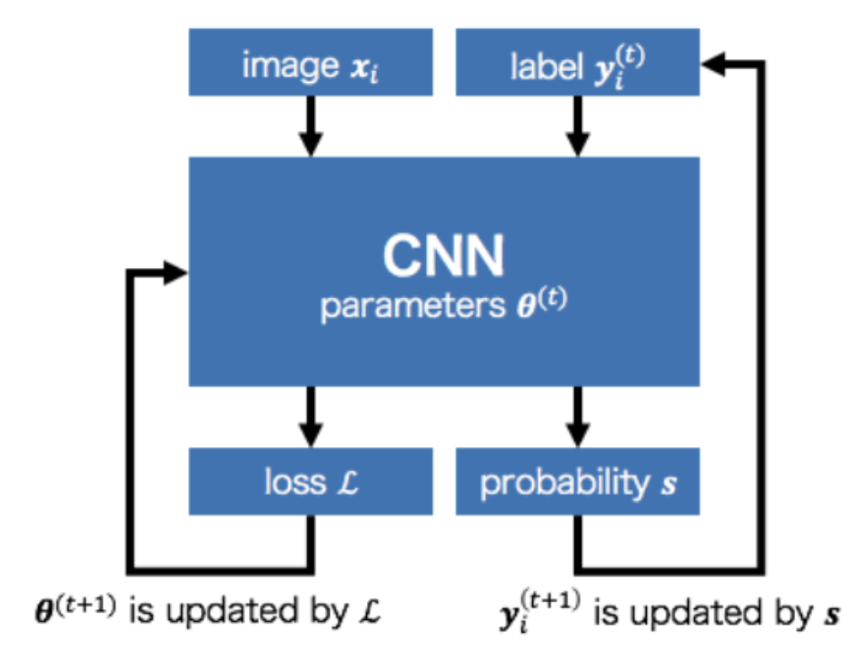

## Classification Using Pseudo-Labeling in Semi-Supervised Learning

### What is semi-supervised learning?

Semi-supervised learning uses a small portion of labeled data and a large amount of unlabeled data to train a model. This is in contrast to supervised learning, in which all data is labeled (regression, random forest, k nearest neighbors) and unsupervised learning (k-means clustering, hierarchical clustering), where all data are unlabeled. 

### Why do we need semi-supervised learning?

Convolutional neural networks are the prevailing approach in computer vision, and require large amounts of labeled data, which can be tricky to acquire. Semi-supervised learning is often used for image classification, which is our topic of interest.

Approaches in image classification focus on the areas of consistency regularization and pseudo-labeling. Consistency regularization encourages the model to produce consistent predictions under different perturbations of the input, to improve the generalizability of the model (talk more about consistency regularization maybe if we want to add more text idk). Pseudo-labeling generates labels for the unlabeled data that are used in the learning process, acting as true labels to use within the loss function. Early methods of pseudo-labeling use the network predictions as labels, but only use the pseudo labels during a warm-up stage (D. Lee, 2013). A later approach uses the network predictions using hard labels as pseudo-labels, and adds an uncertainty weight for each sample loss based on distance from its k-nearest neighbors, as well as a loss term to encourage compact and well-separated clusters, and a term to encourage consistency between perturbed samples (W. Shi et al., 2018). Recent work introduces graph-based label propagation, in which the model is trained on the labeled and pseudo-labeled data, and a nearest-neighbor graph based on the network is created. The pseudo-labels are propagated from the labeled data points to the unlabeled points and uncertainty scores are added based on the softmax predictions for each sample and based on class imbalance (A. Iscen et al., 2019).

{: width="400"}

### Set up and Notation

For this implementation of pseudo-labeling, the authors specified data $D$ with $N$ observations split into labeled and unlabeled sets $$D_l=\{(x_i,y_i)\}^{N_l}_{i=1}$$ and $$D_u=\{x_i\}^{N_u}_{i=1}$$, respectively (Figure 1). Here, the $y_i$ values are one-hot encoded for $C$ possible classes. For example, if there are 3 possible classes and an observation is in the 3rd class, this would be represented as $y=(0,0,1)$. 

This method uses soft pseudo-labeling which differs from hard pseudo-labeling in that it does not store the predicted classes, but rather the predicted softmax probabilities of each class. The pseudo-labels are denoted as $\tilde{y}$, and $\tilde{y}=y$ for the labeled observations. For example, if there are 3 classes, and the model predicts an observation is in class 1 with probability 0.2, class 2 with probability 0.2, and class 3 with probability 0.6, the soft pseudo-label is $\tilde{y}=(0.2,0.2,0.6)$.

### Confirmation bias

When network predictions are incorrect, these predictions are reinforced since the network predictions are used as labels for the unlabeled samples. Overfitting to these incorrect predictions is called confirmation bias. 

To deal with this confirmation bias, the authors use a method known as mixup data augmentation, which uses data augmentation (artificially generating new data from existing data) and label smoothing (a technique that introduces noise to the labels). The mixup method trains the model on sample pairs ($$x_p$$ and $$x_q$$) and corresponding output labels ($$y_p$$ and $$y_q$$)

$$x=\delta x_p + (1-\delta)x_q$$,
$$y=\delta y_p + (1-\delta)y_q$$

Where $$\delta$$ is randomly sampled from a beta distribution Be($$\alpha,\beta$$) with $$\alpha=\beta$$

The combined version of y can be included in the loss function, producing an updated loss equation:

$$
\ell^* = - \Sigma_{i=1}^N\delta[\tilde{y}_{i,p}^{T}log(h_{\theta}(x_i))] +  (1- \delta)[\tilde{y}_{i,q}^{T}log(h_{\theta}(x_i))]
$$

Combining $$y_p$$ and $$y_q$$ reduces prediction confidence, thus reducing overfitting to the predictions.

Including mixup in training generates softmax output $$h_{\theta}(x)$$ using the mixed input x, so a second forward pass using the original images is required to compute predictions that aren’t mixed. 

When there are few labeled samples, mixup may not be able to deal with confirmation bias effectively by itself. To improve the quality of the pseudo labels, the authors mention that previous studies have oversampled the labeled samples per each mini batch to reduce confirmation bias and reinforce correct labels. 

This oversampling technique can be understood by splitting the total loss into a term depending on the labeled samples and a term depending on the unlabeled samples. 

$$
\ell^* = N_l\bar{\ell_l} + N_u\bar{\ell_u}
$$

where $$N_l$$ and $$N_u$$ are the number of labeled and unlabelled samples, and the 
$$
\bar{\ell}_l = \frac{1}{N_l}\Sigma_{i=1}^{N_l}\ell_l^{(i)}
$$
 is the average loss for the labeled samples, and $l_u$ is the average loss for the unlabeled samples. 

When $$N_l$$ << $$N_u$$, the network focuses more on fitting the unlabeled samples correctly compared to the labeled samples. To counteract this, $$N_l$$ can be weighted more heavily or the labeled samples can be oversampled. The authors choose to oversample since it means that the model gets more chances to adjust its parameters to fit the labeled samples.
