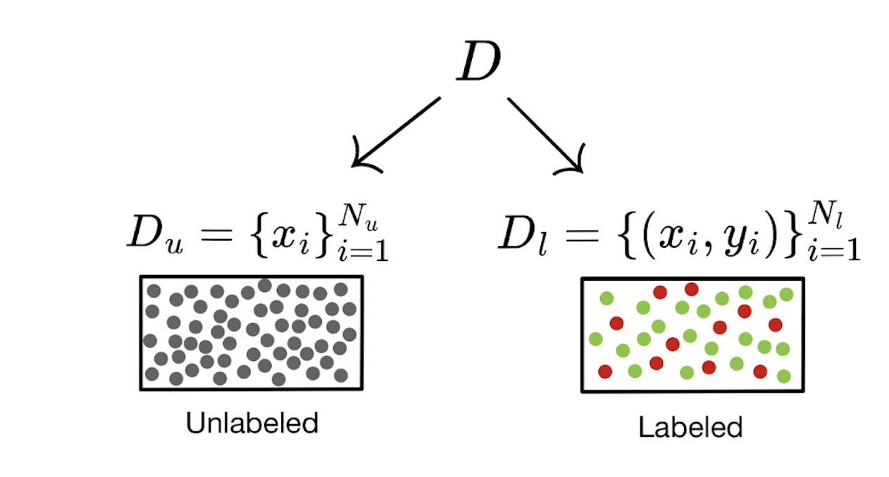

### What is semi-supervised learning?

Semi-supervised learning uses a small portion of labeled data and a large amount of unlabeled data to train a model. This is in contrast to supervised learning, in which all data is labeled (regression, random forest, k nearest neighbors) and unsupervised learning (k-means clustering, hierarchical clustering), where all data are unlabeled. 

### Why do we need semi-supervised learning?

Convolutional neural networks are the prevailing approach in computer vision, and require large amounts of labeled data, which can be tricky to acquire. Semi-supervised learning is often used for image classification, which is our topic of interest.

Approaches in image classification focus on the areas of consistency regularization and pseudo-labeling. Consistency regularization encourages the model to produce consistent predictions under different perturbations of the input, to improve the generalizability of the model (talk more about consistency regularization maybe if we want to add more text idk). Pseudo-labeling generates labels for the unlabeled data that are used in the learning process, acting as true labels to use within the loss function. Early methods of pseudo-labeling use the network predictions as labels, but only use the pseudo labels during a warm-up stage (D. Lee, 2013). A later approach uses the network predictions using hard labels as pseudo-labels, and adds an uncertainty weight for each sample loss based on distance from its k-nearest neighbors, as well as a loss term to encourage compact and well-separated clusters, and a term to encourage consistency between perturbed samples (W. Shi et al., 2018). Recent work introduces graph-based label propagation, in which the model is trained on the labeled and pseudo-labeled data, and a nearest-neighbor graph based on the network is created. The pseudo-labels are propagated from the labeled data points to the unlabeled points and uncertainty scores are added based on the softmax predictions for each sample and based on class imbalance (A. Iscen et al., 2019).

### The Paper

On this page, we will describe the pseudo-labeling methodology proposed in the paper "Pseudo-Labeling and Confirmation Bias in Deep Semi-Supervised Learning" by Arazo et al. published in 2020. 

### Set up and Notation

For this implementation of pseudo-labeling, the authors specified data $$D$$ with $$N$$ observations split into labeled and unlabeled sets $$D_l=\{(x_i,y_i)\}^{N_l}_{i=1}$$ and $$D_u=\{x_i\}^{N_u}_{i=1}$$, respectively (Figure 1). Here, the $$y_i$$ values are one-hot encoded for $$C$$ possible classes. For example, if there are 3 possible classes and an observation is in the 3rd class, this would be represented as $$y=(0,0,1)$$. 

|  | 
|:--:| 
|**Figure 1** |

This method uses soft pseudo-labeling which differs from hard pseudo-labeling in that it does not store the predicted classes, but rather the predicted softmax probabilities of each class. The pseudo-labels are denoted as $$\tilde{y}$$, and $$\tilde{y}=y$$ for the labeled observations. For example, if there are 3 classes, and the model predicts an observation is in class 1 with probability 0.2, class 2 with probability 0.2, and class 3 with probability 0.6, the soft pseudo-label is $$\tilde{y}=(0.2,0.2,0.6)$$.

### Convolutional Neural Networks

The model used by the authors is a convolutional neural network (CNN) with a softmax outcome function, specified as $$h_{\theta}(x)$$, where $$\theta$$ represents the parameters of the network. 

The difference between a CNN and a standard feed-forward neural network we have seen comes in the formulation of the layers and how it attempts to classify images. CNNs work by first identifying small, local features that are then combined together to form broader features, which are then used to calculate the class probabilities. This creates a hierarchical structure in the network, which is illustrated in Figure 2, taken from ISL page 412 (G. James et al., 2021). In this figure, we can see that the network identifies areas of lines, shapes, and colors, which are then combined to identify larger features such as eyes and ears. 

|  | 
|:--:|
|**Figure 2 (ISL Figure 10.6)** |

This process works by using two types of hidden layers: convolution layers and pooling layers. Convolution layers contain a series of convolution filters, which determine whether a small feature is present in the image by going through the entire image in sections the same size as the filter. This is achieved by matrix multiplying the the data in each section by the filter values to create a new matrix of values called the convolved image. If the convolved image has large values, this means that the image section contains features similar to the feature the filter is trying to identify. The convolved images are combined to create a feature map for each filter, which is then passed on to the next layer. The values in each filter, which represent the feature it is identifying,  are comparable to the weight matrices we have seen in feed-forward networks and are the parameters $$\theta$$ being optimized when training the CNN. The number of filters in a layer is analogous to the width of a layer in the networks we have previously seen (G. James et al., 2021).

Pooling layers, the second type of layer used in CNNs, are essentially a form of dimension reduction that reduce a large image into a smaller summary image. One common method is max pooling, which looks at each section in an image and stores only the maximum value found in that section. These layers always come after a convolution layer, although there may be multiple convolution layers before a pooling layer, and therefore reduce the size of the feature maps created by each filter. The combination of convolution and pooling layers is repeated until the feature maps have low dimension, at which point they are flattened into individual units and fed to fully-connected layers before classification with the softmax output layer. An example of a CNN architecture is shown in Figure 3 from ISL page 416 (G. James et al., 2021). 

|  | 
|:--:| 
| **Figure 3** |

As with standard feed-forward networks we saw in class, the CNN used in this paper has a feed-forward structure and uses backpropagation to calculate the gradients to optimize the $$\theta$$ parameters using mini-batch gradient descent. The CNN can also be tuned by adjusting the number, size, and type of the layers, as well as other features such as regularization and dropout terms, like we have previously seen. 

### Loss Function and Regularization
In order to train the CNN, the categorical cross-entropy loss function is used to optimize the parameters $$\theta$$. It has the form 

$$\ell^*=-\sum^N_{i=1}\tilde{y_i}^T\log(h_{\theta}(x_i))$$

where $$h_{\theta}(x)$$ are the predicted probabilities for each class, and an element-wise logarithm is used.

Additionally, 2 regularization terms are included in the loss function to address 2 different issues. In previous assignments, we have seen the tendency for predictions to all fall into the larger class, particularly with unbalanced data, which minimizes the amount of error. The first regularization aims prevent predictions from all being of the same class to minimize this issue, and it has the form 

$$R_A=\sum^C_{c=1}p_c\log\left(\frac{p_c}{\bar{h}_c}\right)$$

Here, $$p_c$$ represents the prior distribution of the probability of being in class $$c$$, which is assumed to be uniform with $$p_c=1/C$$. $$\bar{h}_c$$ is the softmax probability for class $$c$$ averaged across all observations, which is estimated by averaging the probabilities obtained within each mini-batch. If there is perfect agreement between the prior probability and the predicted probability for class $$c$$ ie an even probability distribution between classes, then $$\log(p_c/\bar{h}_c)=\log(1)=0$$, and this regularization term has no effect. If the average predicted probability for class $$c$$ is either very large or very small, ie the predicted probability of being in one class is much larger than the others, the $$\log(p_c/\bar{h}_c)$$ term becomes large, which then penalizes the loss function. 

The second regularization is needed when using soft pseudo-labels instead of hard labels. Without this regularization, the algorithm can get caught in local minima which prevents convergence to the global minima. This regularization avoids these local minima by concentrating the probability distribution of each label to one class, using the entropy averaged over all observations

$$R_H=-\frac{1}{N}\sum^N_{i=1}\sum^C_{c=1}h^c_{\theta}(x_i)\log(h^c_{\theta}(x_i))$$

where $$h_{\theta}^c(x_i)$$ is the $$c$$th softmax probability of from $$h_{\theta}(x_i)$$. Entropy represents the amount of uncertainty in predicting the class of the outcome and is given by $$-\sum^C_{c=1}h^c_{\theta}(x_i)\log(h^c_{\theta}(x_i))$$ portion of the regularization (Vedral, 2002). When the predicted probabilities are very similar, indicating high uncertainty in prediction, the entropy will be high, and when there is less uncertainty, the entropy will be lower. For example, predicted probabilities $$h_{\theta}(x_i)=(.3,.3,.4)$$ have entropy equal to 1.09, whereas the predicted probabilities $$h_{\theta}(x_i)=(.9,.05,.05)$$ have entropy 0.394. Therefore, this regularization term will apply a larger penalty to the loss function when entropy is high, which encourages the probability of one class to be larger than the others. Like with the first regularization term, the average entropy of all observations is estimated by averaging over the observations in each mini-batch. 

It may seem like these regularizations are contradictory, but their weights are adjustable so they're effects don't just cancel out. When we combine the cross-entropy loss with the regularizations, we get the penalized loss function 

$$\ell=\ell^*+\lambda_AR_A+\lambda_HR_H$$

where the $$\lambda$$ values control the amount of regularization, which we have previously seen with L1 and L2 regularization. 

## The Algorithm

|  | 
|:--:| 
| **Figure 4** |

As previously stated, the model used in this paper is a convolution neural network (CNN) that functions similarly to the algorithms we have seen in class and in homework assignments. The network parameters are initialized randomly and then optimized using mini-batch gradient descent by training on the data. 

In order to optimize the network parameters, we first need to get initial soft pseudo-labels for the unlabeled data. To do so, the CNN is trained on the labeled data, $$D_l$$, for 10 epochs as a "warm-up". Then, the warm-up model is used to fit initial softmax predictions to the unlabeled data, $$D_u$$. The combined labeled and pseudo-labeled data are then used to further train the network. In each epoch, the parameters $$\theta$$ are updated using gradient descent on the loss function $$\ell$$ for each mini-batch, and the softmax predictions for each of the unlabeled observations are stored. 

Recall the basic loss function is the categorical cross-entropy loss

$$\ell^*=-\sum^N_{i=1}\tilde{y_i}^T\log(h_{\theta}(x_i))$$

As mentioned in the notation section, both $$\tilde{y}_i$$ and $$h_{\theta}(x_i)$$ are vectors, so multiplying the transpose of $$\tilde{y}_i$$ by the log of the softmax probability vector results in the dot product between the two. For labeled observations, $$\tilde{y}_i$$ is the true vector (eg $$\tilde{y}_i=(0,0,1)$$), so this just outputs the log of the predicted probability of being in the true class. For pseudo-labeled observations, $$\tilde{y}_i$$ is also a vector of softmax probabilities, which means the loss contribution is the dot product of the previous softmax predictions and the log of the new softmax predictions. The regularization terms $$R_H$$ and $$R_A$$ are also calculated (recall they are mini-batch averages), so that the gradient of $$\ell$$ can be calculated to obtain the stepping directions for $$\theta$$.

The new softmax predictions $$h_{\theta}(x_i)$$ for each of the pseudo-labeled observations are stored for each mini-batch in an epoch. At the end of the epoch, the soft pseudo-labels are updated using $$\tilde{y}_i=h_{\theta}(x_i)$$, and these new labels are used in the next epoch (Tanaka et al, 2018). These steps repeat until the specified number of epochs has been reached. An overview of the algorithm is visualized in Figure 4, and Figure 5 shows the general update procedure for the CNN parameters $$\theta$$ and the soft pseudo-labels $$\tilde{y}_i$$. 

|  | 
|:--:| 
| **Figure 5** |

### Confirmation bias

When network predictions are incorrect, these predictions are reinforced since the network predictions are used as labels for the unlabeled samples. Overfitting to these incorrect predictions is called confirmation bias. 

To deal with this confirmation bias, the authors use a method known as mixup data augmentation, which uses data augmentation (artificially generating new data from existing data) and label smoothing (a technique that introduces noise to the labels). The mixup method trains the model on sample pairs ($$x_p$$ and $$x_q$$) and corresponding output labels ($$y_p$$ and $$y_q$$)

$$x=\delta x_p + (1-\delta)x_q, \qquad y=\delta y_p + (1-\delta)y_q$$

Where $$\delta$$ is randomly sampled from a beta distribution Be($$\alpha,\beta$$) with $$\alpha=\beta$$

The combined version of y can be included in the loss function, producing an updated loss equation:

$$
\ell^* = - \Sigma_{i=1}^N\delta[\tilde{y}_{i,p}^{T}log(h_{\theta}(x_i))] +  (1- \delta)[\tilde{y}_{i,q}^{T}log(h_{\theta}(x_i))]
$$

Combining $$y_p$$ and $$y_q$$ reduces prediction confidence, thus reducing overfitting to the predictions.

Including mixup in training generates softmax output $$h_{\theta}(x)$$ using the mixed input x, so a second forward pass using the original images is required to compute predictions that aren’t mixed. 

When there are few labeled samples, mixup may not be able to deal with confirmation bias effectively by itself. To improve the quality of the pseudo labels, the authors mention that previous studies have oversampled the labeled samples per each mini batch to reduce confirmation bias and reinforce correct labels. 

This oversampling technique can be understood by splitting the total loss into a term depending on the labeled samples and a term depending on the unlabeled samples. 

$$
\ell^* = N_l\bar{\ell_l} + N_u\bar{\ell_u}
$$

where $$N_l$$ and $$N_u$$ are the number of labeled and unlabelled samples, and the 
$$
\bar{\ell}_l = \frac{1}{N_l}\Sigma_{i=1}^{N_l}\ell_l^{(i)}
$$
 is the average loss for the labeled samples, and $$l_u$$ is the average loss for the unlabeled samples. 

When $$N_l$$ << $$N_u$$, the network focuses more on fitting the unlabeled samples correctly compared to the labeled samples. To counteract this, $$N_l$$ can be weighted more heavily or the labeled samples can be oversampled. The authors choose to oversample since it means that the model gets more chances to adjust its parameters to fit the labeled samples.

### References

1.	Arazo, E., Ortego, D., Albert, P., O’Connor, N. E. & McGuinness, K. Pseudo-Labeling and Confirmation Bias in Deep Semi-Supervised Learning. in 2020 International Joint Conference on Neural Networks (IJCNN) 1–8 (2020). doi:10.1109/IJCNN48605.2020.9207304.
2.	Lee, D.-H. Pseudo-Label : The Simple and Efficient Semi-Supervised Learning Method for Deep Neural Networks. ICML 2013 Workshop Chall. Represent. Learn. WREPL (2013).
3.	Shi, W. et al. Transductive Semi-Supervised Deep Learning Using Min-Max Features. in Computer Vision – ECCV 2018 (eds. Ferrari, V., Hebert, M., Sminchisescu, C. & Weiss, Y.) vol. 11209 311–327 (Springer International Publishing, Cham, 2018).
4.	Iscen, A., Tolias, G., Avrithis, Y. & Chum, O. Label Propagation for Deep Semi-Supervised Learning. in 5070–5079 (2019).
5.	Vedral, V. The role of relative entropy in quantum information theory. Rev. Mod. Phys. 74, 197–234 (2002).
6.	Tanaka, D., Ikami, D., Yamasaki, T. & Aizawa, K. Joint Optimization Framework for Learning with Noisy Labels. Preprint at http://arxiv.org/abs/1803.11364 (2018).
7.	Krizhevsky, A. Learning Multiple Layers of Features from Tiny Images.
8.	Netzer, Y. et al. Reading Digits in Natural Images with Unsupervised Feature Learning.
9.	Vinyals, O., Blundell, C., Lillicrap, T., Kavukcuoglu, K. & Wierstra, D. Matching Networks for One Shot Learning. Preprint at http://arxiv.org/abs/1606.04080 (2017).
10. James, G., Witten, D., Hastie, T., & Tibshirani, R. (2021). An Introduction to Statistical Learning with Applications in R (2nd ed.). Springer.

